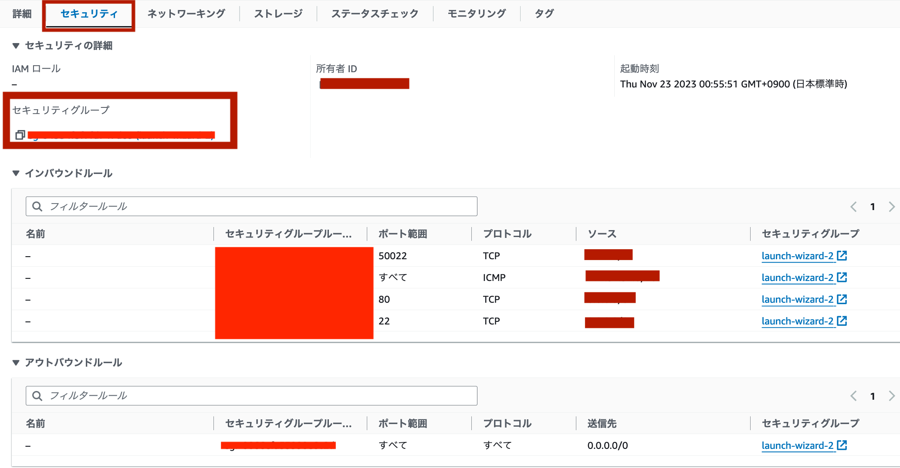
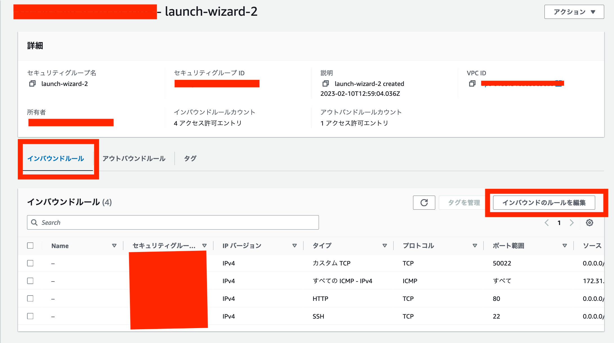

# AWS EC2について

## AWS EC2にssh接続する

```sh
# パーミッションを変更する(読み書きできるとアクセスできないとかある)
chmod 400 <key>

# 公開鍵を指定してアクセス
ssh -i ~/.ssh/id_rsa user@hostname
ssh -i "<キー>.pem" user@host
```

## コンテナ間通信の設定をする

EC2コンテナ間はデフォルトの設定で通信を行うことができない
コンテナで受け入れるプロトコル/IPなどを設定する必要がある。

pingの受信設定をするには以下の手順でできる。

1. コンテナのセキュリティタブの設定から`セキュリティグループのリンク`をクリック

    

2. セキュリティグループでインバウンドルールを編集し`ICMP`を追加する
    サブネットのIPやポートの設定を行うこと

    
