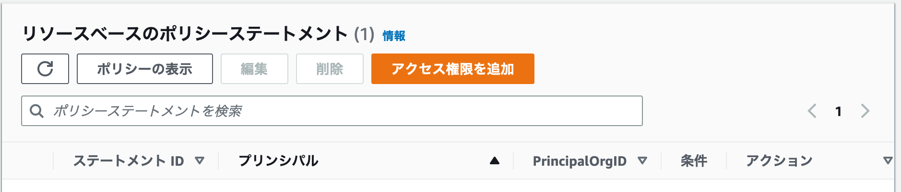

# AWS Lambda

AWS Lambdaについて書いてみる

## AWS EC2にssh接続する

```sh
# パーミッションを変更する(読み書きできるとアクセスできないとかある)
chmod 400 <key>

# 公開鍵を指定してアクセス
ssh -i ~/.ssh/id_rsa user@hostname
ssh -i "<キー>.pem" user@host
```

## AWS Cli　をインストールする

[参考](https://qiita.com/nanbuwks/items/3b500fa1d55b56ef66dc)
[インストーラリンク](https://aws.amazon.com/jp/cli/)

## AWSのユーザを設定する

```sh
# 🌟ここでアクセスキー、シークレットアクセスキー、リージョン、出力形式を設定する
# アクセスキー、シークレットアクセスキーはユーザ作成時に取得できる
aws configure
```

## ユーザにLambda関数の実行権限を割り当てる

おそらく、CLIからも実行できる


## Lambdaを実行する

```sh
# こんな感じで AWS Cliから lambdaを実行できるらしい
# ユーザの設定とかはどこでやるんだろうか？
# あと他オプションがよくわからない。。

# 最小構成としてはこんな感じ
aws lambda invoke --function-name <lambda関数名>  <出力先ファイル>

# 以下、オプションを使うことで python 呼び出し時の Eventから値を取得できる
#  --cli-binary-format raw-in-base64-out --payload '{ "key": "value" }'
aws lambda invoke --function-name <function名> --cli-binary-format raw-in-base64-out --payload '{ "key": "value" }' response.json
```
