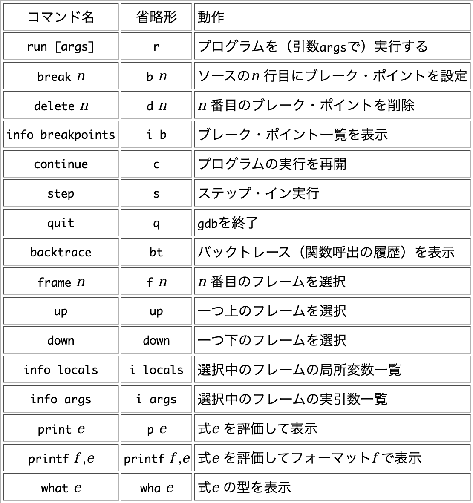

# GDB の使い方& ASSEMBlA

ここでは GDB の使い方,Assembla についてまとめる

- [GDB使い方](#howToUse)
- [coreでバグを調査する](#Bug)
- [Threadをデバッグする](#thread)
- [signalを扱う](#signal)
- [ファイルでマクロ、設定を使い回す](#initFile)
- [マクロ/関数を定義する](#macro)
- [他windowに出力してデバッグする](#gui)
- [systemcall,ライブラリのコールをtraceする](#trace)
- [いろいろ](#etc)

- [アセンブラ](#assembla)

---

## <a name=howToUse>GDB の使い方</a>

- GDB 起動

- exe ファイルを指定して起動 -q オプションはなくてもいいかも

  - 起動後[ctrl]+[X]+[A]でTUIモードに切り替えることができる

```sh
gdb -q ~.out

# 起動済のプロセスにアタッチする gdb単体で起動後に`attach <PID>`でもOK
gdb --pid <PID>
```

- breakpointsの確認方法

```gdb
# breakpointsの確認
info breakpoints  
#無効化
disable [breakpoint no]   
#無効化
enable [breakpoint no]
```

- breakからの実行関連

```gdb
next # 関数の中までは追わない  
step # 関数内まで追う  
continue #次のbreakまで処理を継続  
finish   #関数の終了進む(一個上のスタックまで戻る)  
```

### 処理を飛ばして実行する

こんな感じで実行することで指定行にjumpして処理を継続できる。fileのopenをお試しで`call`して成功して以降の処理で際呼び出しをするとエラーが発生するケースなどで使う

> `jump <行番号>`

---

### <a name=Bug>Coreからバグを調査する</a>

GDBではプログラムが吐いたコアファイルを使ってバグの調査ができる。
ここではそれをまとめる。

- 手順1.coreファイルを含めてgdbを起動する

```sh
# 🌟こんな感じで実行する
gdb <実行ファイル> <coreファイル>
```

- 手順2.backtraceを確認し、どこのスタックフレームで止まったか確認する

```gdb
bt
backtrace 
```

- 手順3.問題のスタックフレームに移動し変数を確認する

```gdb
# 問題のフレームへ移動
frame <btで確認したNo>
# 変数の確認
print <var>
# 現在のスタックフレーム上のローカル変数を確認できる。
info locals 
```

---

### <a name=thread>thread環境をデバッグする</a>

以下のコマンドで各スレッドが何をしているのかがわかる。(わかると言っても動作中の関数ぐらいのものだが、、)

> `info threads`

他のスレッドに移ってスタックを確認するには以下のコマンドで切り替えることができる。

> `thread <スレッドID>`

- 例

```gdb
(gdb) info threads
  Id   Target Id                                  Frame 
* 1    Thread 0x7f1127df2740 (LWP 584) "main.out" 0x00005571e4c5c4d6 in main ()
(gdb) 

🌟 '*'がついている箇所が現在実行しているスレッドになる。
🌟 他のスレッドに移りたい場合はthread <スレッドId>で移動する
```

---

### <a name=etc>他いろいろ</a>

- GDB でデバッグ情報を追加して表示するためのフラグ
  - こうすることで GDB 中の`list` コマンドでソースを見れる

```c
gcc -g ~.c
```

- こんな感じ

```gdb
(gdb) list
1   #include <stdio.h>
2
3   int main(){
4       for(int i =0 ; i < 5;i++){
5           printf("hello world\n");
6       }
7   }
8
```

### GDBでint以外の関数を使う

- GDBでint以外の関数を使うのはめんどくさい。。。

```gdb
print cos(0.0) #だめ
print (double)cos(0.0) #だめ

# 以下のようにすることで使える
set $p = (double (*)(double)) cos #1 cos関数を$pの変数で定義
ptype $p # 型確認コマンド(不要)
p $p(3.14159265) #ここで実行
```

---

### <a name=signal>GDBではsignalをハンドリングしている処理を扱う必要がある</a>

- signalを受けてGDBでプログラムを止めたりすることがる。handleコマンドでいろいろできるらしい

こんな感じ
ただし、本当に発生するシグナルも見落とすことになるので注意

```gdb
# no~~ にどれぐらい種類があるのかは不明
handle SIGSEGV nostop noprint
```

### <a name=gui>GUIなどのウィンドウで動作するプログラムをデバッグする</a>

courseで動作するプログラムのデバッグを想定する。
🚨先に起動したプロセスに`attach`する場合はいらない

- `手順1 プロセスの出力先のコンソールを調べる`

```sh
(base)root@9ea233d8d241:~/Desktop/MyUtils# tty 
/dev/pts/1 # 🌟この出力をコピペしておく
(base)root@9ea233d8d241:~/Desktop/MyUtils# 
```

- `手順2 GDBの入出力先を指定する`

```gdb
# 🌟 ttyコマンドで入出力先のコンソールを指定する
(gdb) tty /dev/pts/1 
(gdb) break main
(gdb) run
# 🌟printfコマンドを使えば出力先のコンソールに出力されることが確認できる
# プログラムの標準入力/出力も同様となる
(gdb) print printf("hello world\n") 
$3 = 12
(gdb) 
```

---

### <a name=trace>strace,ltraceを使ってみる</a>

- strace,ltraceはプログラムが実行したシステムコールを引数、返り値を一緒に表示してくれる。両方とも似たようなツールで共通したオプションも多いので片方を覚えればもう片方も使える。

>`strace`:`システムコールに関して引数と返り値を表示してくれる`  
>`ltrace`:`ライブラリ関数の呼び出しについて表示してくれる`

```bash
strace ./a.out
strace ./a.out -o <logfile> # logfileに出力してくれる
strace ./a.out -o <logfile>　-ff # forkした子プロセスごとに logfile.xxxでプロセス番号付きで表示してくれる
```

---

## <a name=macro>マクロ/関数を定義する</a>

### マクロを定義する

```gdb
define function1 //こんな感じでマクロを定義できる
printf $arg0,$arg1 //引数に最大10個まで取れる
continue
end
```

### ブレークポイント・コマンドリスト

```gdb
commands <breakpoint No>
silent // 余計な出力を減らせる
コマンド(printfや自作の関数など 基本的にC言語と同様に動く)
continue // breakで止まった後で再度動かしてくれる
end
```

### <a name=initFile>.gdbinitファイルでマクロ、breakpoint設定を使い回す</a>

- gdbで使用するためにdefineで定義したコマンドを`.gdbinitファイル`に記述することで他プログラムでも使用することができる。

- `ソースコードと一緒のディレクトリ` or `GDBを起動したディレクトリ`に`.gdbinit`という初期化ファイルを格納することで使える。

gdb実行時に特定の初期化ファイルを指定するには

> gdb -command=`[初期化ファイル]` `[実行ファイル]`

- [gdbで効率的にデバッグするためのTips](https://qiita.com/aosho235/items/e8efd18364408231062d)

```txt
# コマンド履歴を保存する(~/.gdbinitに置くと自動で読み込まれる)
set history save on
set history size 10000
set history filename ~/.gdb_history

# 🌟1 .gdbinitに以下のようにブレークポイントを書いたり
break g

# 🌟2 .gdbinitに以下のようにマクロを書いたり。。
define function1 //こんな感じでマクロを定義できる
printf $arg0,$arg1 //引数に最大10個まで取れる
continue
end

```

---

### <a name=assembla>アセンブラ関連</a>

- 関数をアセンブラで表示する(main は関数名)

  ```gdb
  disassembra main
  ```

- 実行例

  ```gdb
  (gdb) disassemble main
  Dump of assembler code for function main:
  0x0000558c10fcf149 <+0>:  endbr64
  0x0000558c10fcf14d <+4>:  push   %rbp
  0x0000558c10fcf14e <+5>:  mov    %rsp,%rbp
  => 0x0000558c10fcf151 <+8>:   lea    0xeac(%rip),%rdi        # 0x558c10fd0004
  0x0000558c10fcf158 <+15>: callq  0x558c10fcf050 <puts@plt>
  0x0000558c10fcf15d <+20>: mov    $0x0,%eax
  0x0000558c10fcf162 <+25>: pop    %rbp
  0x0000558c10fcf163 <+26>: retq
  End of assembler dump.
  (gdb)
  ```



## Assembla

| 機能名                         | レジスタ名(x86) | レジスタ名(x64) | 詳細                                                                                                                   |
| ------------------------------ | --------------: | --------------: | :--------------------------------------------------------------------------------------------------------------------- |
| インストラクションポインタ     |             eip |             rip | プロセッサによって実行されようとしている現在の命令が格納されているアドレス                                             |
| スタックポインタ               |             esp |             rsp | おそらくスタックフレームと対応するポインタ(引数の先頭？(いや、末尾か？))、スタックフレームの末端のポインタを格納する。 |
| ベースポインタ                 |             ebp |             rbp | 局所変数を参照するためのポインタ(stack フレームに格納された変数を参照するために使われる。)                             |
| ソースインデックス             |             esi |             rsi |                                                                                                                        |
| ディティネーションインデックス |             edi |                 |                                                                                                                        |
| アキュミュレータ               |             eax |                 |                                                                                                                        |
| カウンタ                       |             ecx |                 |                                                                                                                        |
| データレジスタ                 |             edx |                 |                                                                                                                        |
| ベースレジスタ                 |             ebx |                 |                                                                                                                        |

- 命令則

```assembly
命令語 <操作対象> <参照元>
```

- 例
  - $rbp +4 バイトのアドレスを+1 する。

```assembly
addl   $0x1,-0x4(%rbp)
```

現在の実行位置を知るためのコマンド

- **インストラクションポインタ**の中身を参照すれば OK

```sh
 info registers rip
 i r rip
```

格納されたポインタの中身を表示する方法

| 表示内容               | コマンド       | コマンド例          |
| ---------------------- | -------------- | ------------------- |
| 文字列表示             | x/s <ポインタ> | `x/s x/s $rbp-0x20` |
| プログラム上の変数表示 | x/s <変数名>   | `x/s str`           |
