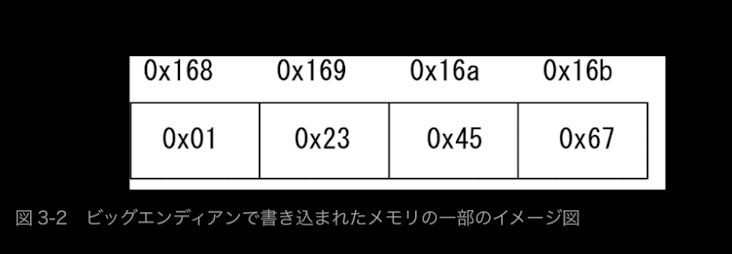
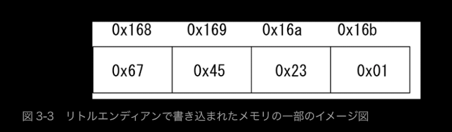

# バイナリ解析について

このページは初めて学ぶバイナリ解析についての備忘録である。

- [バイトオーダー](#byteorder)
- [スタックについて](#stack)
- [レジスタについて](#registor)

アセンブラ出力の方法
> gcc -S <ファイル名>.c

---
---

## <a name=byteorder>バイトオーダー</a>

0x01234567という数字を扱う場合

### ビッグエンディアン

アドレスの下位に高い桁の数字をあてがっていく方式
(数値の高い桁から順に書き込んでいく)



### **リトルエンディアン(一般的にこれが使われている！！)**

アドレスの高位に低い位の数字をあてがっていく方式
(数値の低い桁から順に書き込んでいく)


---
---

## <a name=stack>スタックについて</a>

基本的なことだが、メモリ領域においてプログラム部とスタック部に分けられる。
グローバル変数はプログラム部に格納され、ローカル変数はスタック部に保存される。
スタックは`push`によって`上位から下位のアドレス`に向かって伸びていく

ここで覚えておきたいのは、`ESP`,`EBP`,`EIP`についてである。
スタックの一番上(一番低いアドレス)をtop、底(一番高いアドレス)をbottomと呼ぶ

トップとボトムはCPUのレジスタに保存され以下の名前がつけられている

- **ESP(RSP)(Extended Stack Pointer)**
トップのアドレスを格納するポインタのこと
- **EBP(REP)(Extended Base Pointer)**
ボトムのアドレスを格納するポインタのこと
- **EIP(RIP)**
メモリ上の、次に実行する命令のアドレスを常に格納している

スタックの積まれ方とEBP,ESP,EIPについて解説する

```text
1. 引数を外側からpushしていく
2. callでRIP(EIP)の値がリターンアドレスとしてpushされる
2.1.call直後、RBP(EBP)が上位のスタックの情報としてpushされる。
3. RSP(ESP)の値をRBP(EBP)に書き換える。
4. 関数実行で、ローカル変数が積まれる。

Low Addr
:
1.stack          2.stack          2.1.stack        3.stack          4.stack
|.......|________|x2.....|________|x2.....|________|x2.....|________|x2.....|_RSP
|.......|________|x1.....|________|x1.....|_RSP____|x1.....|_RSP,RBP|x1.....|_RBP
|.......|________|.......|_RSP____|bk RBP.|________|bk RBP.|________|bk RBP.|
|.......|_RSP____|retAddr|________|retAddr|________|retAddr|________|retAddr|
|arg1...|________|arg1...|________|arg1...|________|arg1...|________|arg1...|
|arg2...|________|arg2...|________|arg2...|________|arg2...|________|arg2...|
|arg3...|________|arg3...|________|arg3...|________|arg3...|________|arg3...|
|.......|________|.......|________|.......|________|.......|________|.......|
|.......|_RBP____|.......|_RBP____|.......|_RBP____|.......|________|.......|
|.......|________|.......|________|.......|________|.......|________|.......|
 High Addr

```

```text
5. RBP(EBP)の値をRSP(ESP)に書き換える。
6. 退避したRBPをpopしてRBPに書き換える。
7. retが実行され、リターンアドレスがRIP(EIP)になり、
　　RSP(ESP)が書き換わる。
8. 元の関数に戻る

🚨一般的にはこんな感じで描かれるが、コンパイラでアセンブラを出力すると、
ローカル変数をpushで作成せずにESP(RBP)からのオフセットで変数を確保するような挙動をする場合もある。
また、引数を他のレジスタに格納してpushでスタックに置かないパターンもある模様

Low Addr
:
5.stack          6.stack          7.stack      8.stack
|x2.....|________|x2.....|________|x2.....|________|x2.....|
|x1.....|________|x1.....|________|x1.....|________|x1.....|
|bk RBP.|_RSP,RBP|.......|_RSP____|.......|________|.......|
|retAddr|________|retAddr|________|retAddr|_RSP____|.......|_RSP
|arg1...|________|arg1...|________|arg1...|________|arg1...|
|arg2...|________|arg2...|________|arg2...|________|arg2...|
|arg3...|________|arg3...|________|arg3...|________|arg3...|
|.......|________|.......|________|.......|________|.......|
|.......|_RBP____|.......|_RBP____|.......|_RBP____|.......|_RBP
|.......|________|.......|________|.......|________|.......|
 High Addr

```

---
---

## <a name=registor>レジスタについて</a>

接頭語に`E`や`R`の文字があてがわれているが、以下の認識でOK。
種類として`汎用レジスタ`,`特殊レジスタ`,`フラグレジスタ`の3つが存在する。

- E = 32bit
- R = 64bit

レジスタに格納されている値を確認するには`GDB`にてbreak中に以下のコマンドを実行することで確認できる

```gdb
# レジスタの状態を表示
(gdb) info registers
(gdb) i registers
(gdb) i r

# 特定のレジスタの値を表示（例：rax）
(gdb) print/x $rax

# 逆アセンブリ結果を表示
(gdb) set disassembly-flavor intel
(gdb) set disassembly-flavor att
(gdb) disassemble main
```

### **汎用レジスタ**

|機能名|名称|中身|
|--|--|--|
|EAX|アキュムレーターレジスタ|返り値(計算結果など)|
|EBX|ベースレジスタ|アドレスのベース値|
|ECX|カウンタレジスタ|ループ回数のカウンタ|
|EDX|データレジスタ|演算に使うデータ|
||||

### **特殊レジスタ**

|機能名|名称|中身|
|--|--|--|
|ESP|スタックポインタ|**実行中の関数の**トップを常に表す|
|EBP|ベースポインタ|**実行中の関数の**ボトムを常に表す|
|EIP|インストラクションポインタ|**メモリのプログラム部の**、次に実行する命令のアドレスを常に格納している|
||||

### **フラグレジスタ**

命令や演算の結果として生じた状態を保存したレジスタ
フラグレジスタの状態によって条件付き分岐命令の分岐先が決定する。
`EFLAGS`レジスタという32bitにまとめられていて、状態によって各ビットが1になる。
使用頻度の高いもので、`ゼロフラグ(6bit目)`というものがあり、
`直前の命令結果が0ならフラグが立ち(1になり)`、`0以外ならフラグが下がる(0になる)`。


---
---
