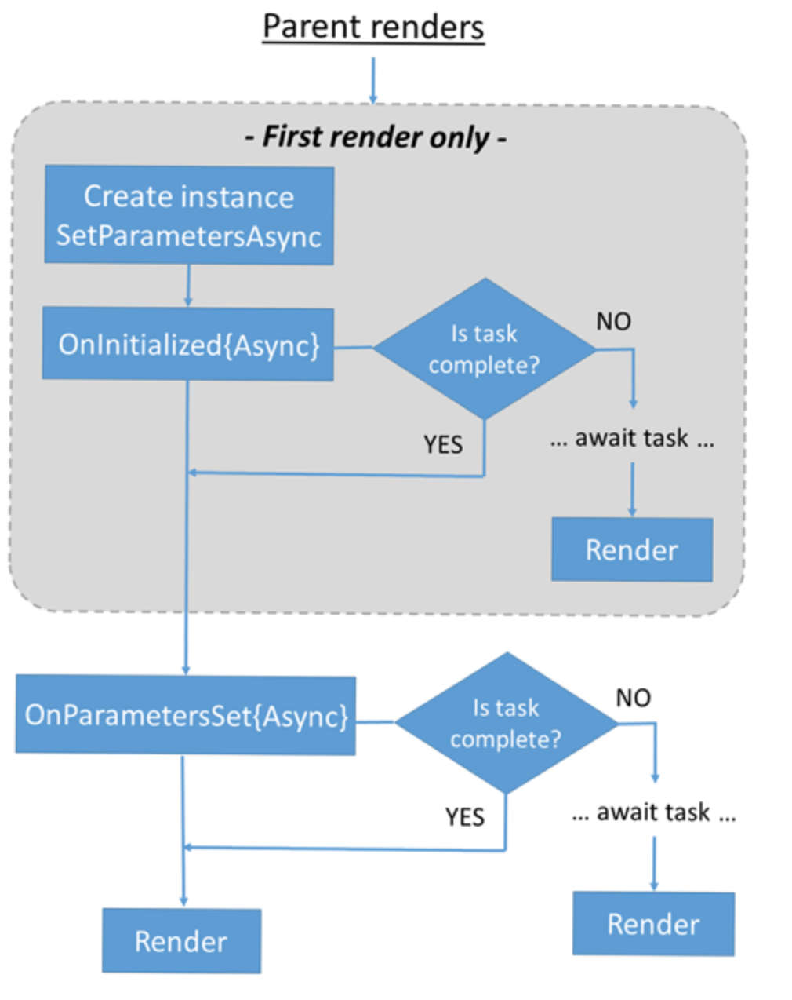

# Blazorについて

Blazorを仕事で使うこととなったため、仕方なく使い方をまとめる

- [基本的な考え方](#basic)
- [可変URL作成](#valiable)
- [URLからパラメータを取得する場合](#getParameter)

---

## <a name=basic>基本的な考え方</a>

Razor コンポーネントは、一連の同期および非同期のライフサイクル メソッド内の Razor コンポーネント ライフサイクル イベントを処理します。 ライフサイクル メソッドをオーバーライドして、コンポーネントの初期化およびレンダリング中にコンポーネントで追加の操作を実行できます。

[公式ドキュメント](https://learn.microsoft.com/ja-jp/aspnet/core/blazor/components/lifecycle?view=aspnetcore-7.0)

- 以下の順番で実行される

`SetParametersAsync`  
`OnInitialized{Async}`  
`OnParametersSet{Async}`  



### コンポーネントの初期化 (OnInitialized{Async})

```cs
@page "/on-init"

<p>@message</p>

@code {
    private string? message;

    protected override void OnInitialized()
    {
        message = $"Initialized at {DateTime.Now}";
    }
}

protected override async Task OnInitializedAsync()
{
    await ...
}
```

他にもいろいろあるので、`公式ドキュメント`で確認すること

### パラメーターが設定された後 (OnParametersSet{Async})

```cs
@page "/on-params-set"
@page "/on-params-set/{StartDate:datetime}"

<p>@message</p>

@code {
    private string? message;

    [Parameter]
    public DateTime StartDate { get; set; }

    protected override void OnParametersSet()
    {
        if (StartDate == default)
        {
            StartDate = DateTime.Now;

            message = $"No start date in URL. Default value applied (StartDate: {StartDate}).";
        }
        else
        {
            message = $"The start date in the URL was used (StartDate: {StartDate}).";
        }
    }
}
```

---
---

## <a name=valiable>可変URL作成</a>

`「https://usefuledge.com/details/A」`や`「https://usefuledge.com/details/B」`  
のように、URLの一部を可変にするには

```cs
// pageディレクティブをこんな感じで定義
@page "/details/{CodeID?}"

// codeディレクティブを以下で設定するだけ
[Parameter]
public string codeID {get; set;}
```

---

## <a name=getParameter>URLからパラメータを取得する場合</a>

`https://pacode.net/?languageID=8`のように、URLパラメタを取得したい場合

```cs
// Pageディレクティブ
@page "/"

// codeディレクティブ
[Parameter]
[SupplyParameterFromQuery]
// String?とすることで、Nullを許容した文字列型になる
public String? languageID {get; set;}
```

