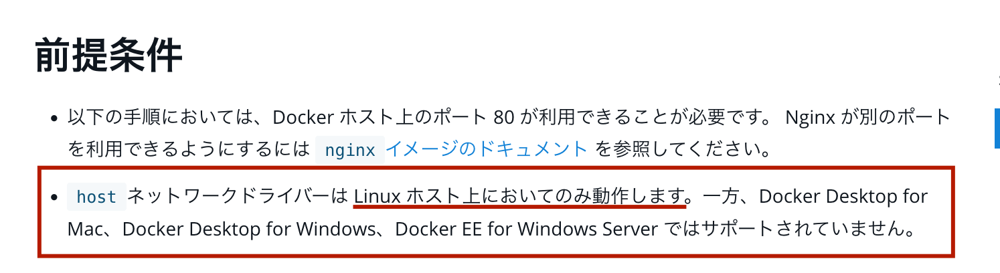

# Dockerコンテナのネットワークについて

```sh
docker network create
docker network connect
docker network ls
docker network rm
docker network disconnect
docker network inspect
```

- [コンテナのネットワーク設定](#containerNet)

## ひとまずDockerのネットワークについて

dockerのインストールされている環境には`docker0`などの  
`bridge`のネットワークが作成される。

`docker run --net=<ネットワーク名>`でnetworkを指定しない限り、
デフォルトで`docker0`の`bridge`に接続される。

んで、`docker network ls`で確認できるが、自動でdockerコンテナ用のnetworkが3つ作成される

コンテナはデフォルトで`bridge`に接続される。
(コンテナ間はbridgeで繋がっているため、pingも通る)

`ホスト側の（host ）ネットワーク・スタック`にコンテナに接続することで、
コンテナ内のネットワーク設定が、ホスト上と同じに見えるでしょう。

```sh
$ docker network ls
NETWORK ID          NAME                DRIVER
7fca4eb8c647        bridge              bridge
9f904ee27bf5        none                null
cf03ee007fb4        host                host
```

🚨 [hostネットワークに関して](https://matsuand.github.io/docs.docker.jp.onthefly/network/network-tutorial-host/)



---
---

## ネットワークを作成する

Dockerでは`ブリッジ・ネットワーク`や`オーバレイ・ネットワーク`を作成できる。
また、ネットワークは`複数作成`できます。`コンテナを１つ以上のネットワークに追加できます`。コンテナの通信はネットワーク内だけでなく、ネットワーク間を横断できます。コンテナが２つのネットワークにアタッチする時、どちらのネットワークに対しても通信可能です。コンテナが複数のネットワークに接続時、外部への通信は単語順で１つめの非内部ネットワークを経由します。

---

### ブリッジネットワークを作成する(単一ホスト上で比較的小さなネットワークの実行時に便利)

> docker network create --driver bridge <network名>

ネットワーク内の各コンテナは通信可能  
しかし、コンテナ自身が含まれるネットワークは外部のネットワークから独立しています。
ユーザ定義ブリッジ・ネットワークの内部では、リンク機能はサポートされません。
しかし、ネットワーク上にあるコンテナのポートは公開可能です。

さらに大きなネットワークを作成する場合は、`オーバーレイ`を検討しましょう

### オーバーレイ・ネットワークを作成する

`Docker overlay network` を使うことで異なるL3 上(Dockerの場合は`異なるDockerホスト上`) に存在する`コンテナ`に対して、  
`同じネットワークに存在するコンテナとして透過的にアクセスすることができるようになります。`  
`VXLAN` を利用して実装されているらしい(よくわからん。。。)

[オーバーレイ・ネットワークに関して(公式)](https://matsuand.github.io/docs.docker.jp.onthefly/network/overlay/)  
[実装手順](https://matsuand.github.io/docs.docker.jp.onthefly/network/network-tutorial-overlay/)  

### 手順を以下に示す

[1.Dockerホストで`Swarmを初期化`or `既存のSwarmに追加`させる](#how1)  
[2. Swarm サービスに対して利用するオーバーレイネットワークを生成する](#how2)  

#### <a name=how1>1.Dockerホストで`Swarmを初期化`or `既存のSwarmに追加`させる</a>

`Swarm`はサービス名らしい(VXLANの制御とかするのかな？)

```markdown

- Docker ホスト間でのトラフィックのやりとりのため、以下のポートを公開する必要がある。
TCP ポート 2377、クラスター管理に関する通信用。
TCP と UDP のポート 7946、ノード間の通信用。
UDP ポート 4789、オーバーレイネットワークトラフィック用。

- オーバーレイネットワークを生成する前に以下のどちらかで、Swarmにホストを追加する必要がある。

# 🌟Swarn作成🌟
なんか ubuntu(manager)/mac(worker)で作成できなかった、、

## 🌟manager側
docker swarm init --advertise-addr=<managerのIPアドレス>

## 🌟worker側
docker swarm join --token <トークン> \
--advertise-addr <worker-1のIPアドレス> \
<managerのIPアドレス>:2377
```

#### <a name=how2>2. Swarm サービスに対して利用するオーバーレイネットワークを生成する</a>

```markdown
- over-rayネットワーク間でのやりとりだけが目的なら
docker network create -d overlay my-overlay

- スタンドアロンコンテナー においても 利用することが必要な場合で、他の Docker デーモン上で動作する他のスタンドアロンコンテナーとも通信を行う必要がある場合は、--attachableフラグを加えます。
docker network create -d overlay --attachable my-attachable-overlay

- `--opt encrypted --attachable`を同時に指定すれば、このネットワークに対して、管理外にあったコンテナーをアタッチさせることができます。
docker network create --opt encrypted --driver overlay --attachable my-attachable-multi-host-network

```

---
---

### <a name=containerNet> コンテナにネットワークを追加する</a>

Docker上のコンテナは動的にネットワークに参加/不参加を
切り替えることができる。
動作的には`NIC`をつけたり外したりした感じ

```sh
docker network connect <network名> <container名>
docker network disconnect <network名> <container名>
```

🌟以下のようになる

```sh
user@macbook ~ % docker network connect bridge  ubuntuJpyter2 
user@macbook ~ % docker exec -it ubuntuJpyter2 'ifconfig'    
# 🌟 eth1のネットワーク層あり
eth1: flags=4163<UP,BROADCAST,RUNNING,MULTICAST>  mtu 1500
        inet 172.17.0.2  netmask 255.255.0.0  broadcast 172.17.255.255
        ether 02:42:ac:11:00:02  txqueuelen 0  (イーサネット)
        RX packets 12  bytes 936 (936.0 B)
        RX errors 0  dropped 0  overruns 0  frame 0
        TX packets 0  bytes 0 (0.0 B)
        TX errors 0  dropped 0 overruns 0  carrier 0  collisions 0

lo: flags=73<UP,LOOPBACK,RUNNING>  mtu 65536
        inet 127.0.0.1  netmask 255.0.0.0
        loop  txqueuelen 1000  (ローカルループバック)
        RX packets 4  bytes 200 (200.0 B)
        RX errors 0  dropped 0  overruns 0  frame 0
        TX packets 4  bytes 200 (200.0 B)
        TX errors 0  dropped 0 overruns 0  carrier 0  collisions 0

# 🌟 disconnectで削除する
user@macbook ~ % docker network disconnect bridge  ubuntuJpyter2
user@macbook ~ % docker exec -it ubuntuJpyter2 'ifconfig'       
# 🌟 eth1のネットワーク層が消える
lo: flags=73<UP,LOOPBACK,RUNNING>  mtu 65536
        inet 127.0.0.1  netmask 255.0.0.0
        loop  txqueuelen 1000  (ローカルループバック)
        RX packets 4  bytes 200 (200.0 B)
        RX errors 0  dropped 0  overruns 0  frame 0
        TX packets 4  bytes 200 (200.0 B)
        TX errors 0  dropped 0 overruns 0  carrier 0  collisions 0

user@macbook ~ % 

```
