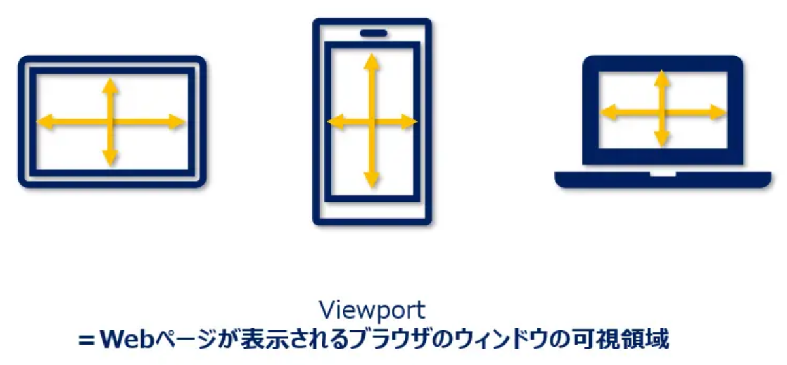
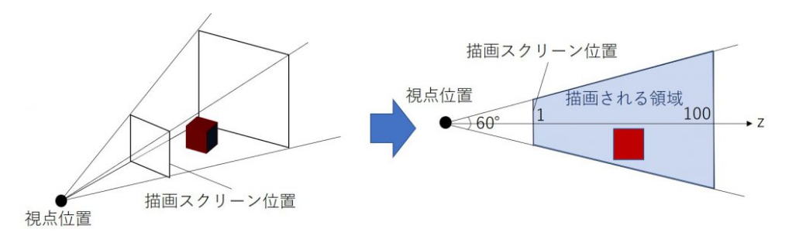

# WebGLについて書いてみる

- [sample](sample)
- [sample2](sample2)

- [shaderについて](shader)

- [viewportについて](#viewport)
- [LookAtについて(カメラ位置/向き/姿勢)](#lookat)
- [Perspective(視野)](#Perspective)

```html
<!doctype html>
<html lang="ja">
  <head>
    <meta charset="utf-8" />
    <title>WebGL デモ</title>
    <script src="webgl-demo.js" type="module"></script>
  </head>

  <body>
    <canvas id="glcanvas" width="640" height="480"></canvas>
  </body>
</html>

```

```js
main();

//
// ここから開始
//
function main() {
  const canvas = document.querySelector("#glcanvas");
  // GL コンテキストを初期化
  const gl = canvas.getContext("webgl");

  // WebGL が使用可能で動作している場合にのみ続行
  if (gl === null) {
    alert(
      "WebGL を初期化できません。ブラウザーまたはマシンが対応していない可能性があります。",
    );
    return;
  }

  // クリアカラーを黒に設定し、完全に不透明する
  gl.clearColor(0.0, 0.0, 0.0, 1.0);
  // 指定されたクリアカラーでカラーバッファーをクリアする
  gl.clear(gl.COLOR_BUFFER_BIT);
}
```

## <a name=viewport>viewportについて</a>

ビューポートとはウィンドウの中で表示を行うエリアのこと
canvasに(1000,700)の幅で設定しても、

```js
// (x0,y0,x1,y1)
/*
viewportを設定することでcanvas上のどこに描画するかを設定できる
canvas-----------------------(1000,700)|
|                                      |
|-------------(width,height)|          |
|                           |          |
|                           |          |
|                           |          |
(0,0)-----------------------|----------|

*/
gl.viewport(0,0,width/2,height/2)
```



## <a name=lookat>lookAt関数を使う</a>

lookAt は WebGL でカメラの向きを設定する関数です。 eye はカメラの位置、 at はカメラが向く点、 up は上方向のベクトルを表します。 lookAt 関数はカメラの変換行列を設定するために使用されます

```js
var camera = mat4.create();//カメラのビュー行列
var eye = vec3.fromValues(0.0, 0.0, 5.0);//カメラ位置
var at = vec3.fromValues(0.0, 0.0, 0.0);//カメラの向き
var up = vec3.fromValues(0.0, 1.0, 0.0);//上方向のベクトル

mat4.lookAt(camera, eye, at, up);
```

## <a name=Perspective>視野を設定する</a>

```js
var camera = mat4.create();//カメラのビュー行列
var fieldOfView = 45 * Math.PI / 180; // 視野角
var aspect = gl.canvas.clientWidth / gl.canvas.clientHeight;//アスペクト比
var zNear = 0.1;//近くのクリップ面
var zFar = 100.0;//遠くのクリップ面

mat4.perspective(camera, fieldOfView, aspect, zNear, zFar);
```


