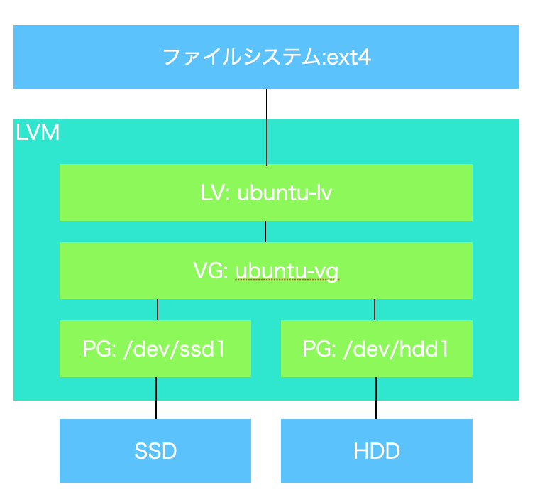

# filesystem

Linuxのfilesystemについてのあれこれをメモってく

- [ストレージのデバイスファイルを探す(`lsblk`)](#lsblk)
- [パーティションを作成する(`parted(GPT/MBR)`)](#parted)
- [`df`について](#df)
- [`fdisk(MBRのみ)`について(hdd,ssdのパーティション作成)](#fdisk)
- [`mkfs`について(ファイルシステム作成)](#mkfs)
- [`mount`について(mountの仕方/OS起動時自動マウント設定)](#mount)
- [ハードリンク/シンボリックリンクについて](#link)

---

## キーワード備忘録

### パーティションについて

1. パーティションの管理方式には`GPT(推奨)`と`MBR(古)`がある。
MBRは古い仕様で以下の制限がある。

- `ストレージ上にパーティションは4つまで`
- `扱えるストレージ容量は2TBまで`

1. 従来のPCの起動には`BIOS`モードと`UEFI`モードがある。
`UEFIモード`で起動する場合、OSのインストール先のパーティションは`GPT`である必要がある。

🚨`fdisk`は`MBR`しか扱えないので使い方に注意すること。

### ファイルシステムとは

データに名前を付け、ファイルという単位で管理する仕組み以下の形式がある。
`mkfs`で作成できるが、既存のデータが消去されるので注意が必要
作成後、ディレクトリツリーにマウントすることでフォルダなどとして使うことができる。

- Windows : NTFSなど
- Linux: ext4/xfs/btrfs/ext2(古い仕様)など
- SD/USB: FAT32/exFATなど

### LVM（Logical Volume Manager）について

ボリュームを抽象化して使うLinuxの機能。パーティションを直接操作するのではなく、各パーティションを`物理ボリューム(PV)`として扱い、1つ以上の`ボリュームグループ(VG)`というグループとして管理する。
`ボリュームグループ(VG)`の中に`論理グループ(LV)`を作成する。
OSからは`論理グループ(LV)`を従来のパーティションとして扱える。
LVMとして抽象化することで`複数のストレージを束ねて大容量化`したり、`後から追加`したりが可能となる。
以下がレイヤーの構成となる。
LVM作成の手順等は後日、別でまとめる。



---

## <a name=lsblk>ストレージのデバイスファイルを探す(lsblk)</a>

ブロックデバイスの情報が表示されます。
これにより、ディスクやパーティションの構成、ファイルシステムの情報などが確認できます。

## <a name=parted>パーティションを作成する(parted)</a>

- パーティションテーブルを作成する

```sh
# mklabelのオプション gpt/msdos を選べる
sudo parted /dev/"対象デバイスファイル" -s 'mklabel gpt'
```

- パーティションを作成する
作成されるとデバイスファイル名に番号が振られた新しいデバイスファイルが追加される

```sh
# [ファイルフォーマット(省略可能)] [開始位置] [終了位置]
# primary(基本)かextended(拡張)を選ぶ(頭文字のみでも可)
sudo parted /dev/"対象デバイスファイル" -s 'mkpart primary 0% 100% print'
```

---

## <a name='df'>filesystemのをみるやつ</a>

> df -h

|Filesystem|Size|Used|Avail Use% |Mounted on|
|--|--|--|--|--|
|ディスク名|全ディスク容量|使用容量|空き容量|使用率|ディスクがファイルシステム上のどこにマウントされているのか(マウントポイント)|

```sh
(base)root@ubuntu:~\# df -h
Filesystem      Size  Used Avail Use% Mounted on
overlay          59G   28G   29G  49% /
tmpfs            64M     0   64M   0% /dev
shm              64M     0   64M   0% /dev/shm
grpcfuse        466G  426G   22G  96% /root/Desktop
/dev/vda1        59G   28G   29G  49% /etc/hosts
tmpfs           2.0G     0  2.0G   0% /proc/acpi
tmpfs           2.0G     0  2.0G   0% /sys/firmware
```

```sh
(base)root@ubuntu:~\# df --help
使用法: df [オプション]... [ファイル]...
Show information about the file system on which each FILE resides,
or all file systems by default.

Mandatory arguments to long options are mandatory for short options too.
  -a, --all             include pseudo, duplicate, inaccessible file systems
  -B, --block-size=SIZE  scale sizes by SIZE before printing them; e.g.,
                           '-BM' prints sizes in units of 1,048,576 bytes;
                           see SIZE format below
  -h, --human-readable  print sizes in powers of 1024 (e.g., 1023M)
  -H, --si              print sizes in powers of 1000 (e.g., 1.1G)
  -i, --inodes          ブロック使用量の代わりに iノード情報を表示する
  -k                    --block-size=1K と同様
  -l, --local           ローカルファイルシステムのみ表示するように制限する
      --no-sync         使用量の情報を得る前に sync を行わない (デフォルト)
      --output[=FIELD_LIST]  use the output format defined by FIELD_LIST,
                               or print all fields if FIELD_LIST is omitted.
  -P, --portability     use the POSIX output format
      --sync            invoke sync before getting usage info
      --total           elide all entries insignificant to available space,
                          and produce a grand total
  -t, --type=TYPE       limit listing to file systems of type TYPE
  -T, --print-type      print file system type
  -x, --exclude-type=TYPE   limit listing to file systems not of type TYPE
  -v                    (ignored)
      --help     この使い方を表示して終了する
      --version  バージョン情報を表示して終了する

--block-size で指定した SIZE, DF_BLOCK_SIZE, BLOCK_SIZE およびBLOCKSIZE 環境変数
のうち、最初に指定されているサイズ単位で値が表示されます。それ以外の場合、デフォ
ルトの単位は 1024 バイトになります (POSIXLY_CORRECT が設定されている場合 512 バ
イト)。

The SIZE argument is an integer and optional unit (example: 10K is 10*1024).
Units are K,M,G,T,P,E,Z,Y (powers of 1024) or KB,MB,... (powers of 1000).

FIELD_LIST is a comma-separated list of columns to be included.  Valid
field names are: 'source', 'fstype', 'itotal', 'iused', 'iavail', 'ipcent',
'size', 'used', 'avail', 'pcent', 'file' and 'target' (see info page).

GNU coreutils online help: <https://www.gnu.org/software/coreutils/>
Report df translation bugs to <https://translationproject.org/team/>
Full documentation at: <https://www.gnu.org/software/coreutils/df>
or available locally via: info '(coreutils) df invocation'

```

---

## <a name='fdisk'>hdd,ssd,パーティションの操作関連</a>

`fdisk`コマンドを実行することでパーティションを操作したりできる。

```sh
# パーティション一覧を表示
fdisk -l
```

- fdisk --help

```sh
(base)root@ubuntu:~# fdisk --help

使い方:
 fdisk [オプション] <ディスク>      パーティションテーブルを変更
 fdisk [オプション] -l [<ディスク>] パーティションテーブルを一覧表示

ディスクのパーティション情報を表示または操作します。

オプション:
 -b, --sector-size <サイズ>    物理および論理セクタサイズ
 -B, --protect-boot            boot　ビットを消さずに新しいラベルを作成します
 -c, --compatibility[=<モード>] 互換モード: 'dos' または 'nondos' (既定値)
 -L, --color[=<いつ>]          メッセージを色づけします(auto、always、never のどれか)
                                 カラー表示はデフォルトで有効です
 -l, --list                    パーティション一覧を表示して終了します
 -o, --output <list>           出力する列を指定します
 -t, --type <種類>             指定した種類のパーティションテーブルのみを認識させます
 -u, --units[=<単位>]          表示単位: 'cylinders' または 'sectors' (既定値)
 -s, --getsz                   デバイスのサイズを 512バイトセクタ数で表示します（非推奨）
     --bytes                   可読性の高い形式ではなく、バイト単位でサイズを表示します
 -w, --wipe <モード>           署名を消去する (auto, always, never のどれか)
 -W, --wipe-partitions <モード>  新しいパーティションから署名を消去する (auto, always, never のどれか)

 -C, --cylinders <数値>        シリンダ数を指定します
 -H, --heads <数値>            ヘッド数を指定します
 -S, --sectors <数値>          1 トラックあたりのセクタ数を指定します

 -h, --help                    display this help
 -V, --version                 display version

Available output columns:
 gpt: Device Start End Sectors Size Type Type-UUID Attrs Name UUID
 dos: Device Start End Sectors Cylinders Size Type Id Attrs Boot End-C/H/S Start-C/H/S
 bsd: Slice Start End Sectors Cylinders Size Type Bsize Cpg Fsize
 sgi: Device Start End Sectors Cylinders Size Type Id Attrs
 sun: Device Start End Sectors Cylinders Size Type Id Flags

詳しくは fdisk(8) をお読みください。
```

---

## <a name='mkfs'>ファイルシステム作成</a>

```sh
mkfs -t <type> <ディスク>
mkfs -t ext4 /dev/sdb1
```

```sh
(base)root@ubuntu:~# mkfs --help

使い方:
 mkfs [オプション] [-t <タイプ>] [fs-options] <デバイス> [<サイズ>]

Linux ファイルシステムを作成します。

オプション:
 -t, --type=<タイプ>  ファイルシステムの種類を指定します。何も指定しない場合、  ext2 が指定されたものとみなします
     fs-options     実際のファイルシステムビルダに渡すオプションを指定します
     <デバイス>       使用すべきデバイスのパスを指定します
     <サイズ>         このデバイスで使用するブロック数を指定します
 -V, --verbose      何が行われるのかを詳しく表示します;
                      2 つ以上 -V を指定すると、実際には何も行わないようになります。
 -h, --help         display this help
 -V, --version      display version

詳しくは mkfs(8) をお読みください。
(base)root@ubuntu:~# 

```

---

## <a name='mount'>mountについて</a>

### 手動でmountする

1. マウント先のディレクトリを作成する
2. `mount`コマンドでディスクをディレクトリにマウントする
3. `df -h`でmountされたことを確認する

```sh
$ df -h　# 🌟dfで一応状態を確認
ファイルシス            サイズ  使用  残り 使用% マウント位置
/dev/mapper/centos-root   8.5G  4.9G  3.6G   58% /
devtmpfs                  482M     0  482M    0% /dev
tmpfs                     497M   84K  497M    1% /dev/shm
/dev/sda1                 497M  210M  288M   43% /boot
tmpfs                     100M   20K  100M    1% /run/user/42
[root@pg-rex01 ~]$ mkdir -p /database  # 🌟マウントポイントを作成
[root@pg-rex01 ~]$ mount /dev/sdb1 /database　# 🌟ファイルシステムとマウントポイントを指定する。

```

### 起動時に自動でmountさせる

- `/etc/fstab`にマウント設定を記述する。  
  (デバイス名で指定することもできるが、OS起動時にデバイス名が変わる可能性もあるのでUUIDで指定する方がよい)
- `blkid`コマンドでUUIDが確認できる

🌟こんな感じらしい

```sh
[root@pg-rex01 ~]# blkid /dev/sdb1
/dev/sdb1: UUID="4208687d-cb09-4821-bc5e-c7614f1ad14d" TYPE="ext4" 
[root@pg-rex01 ~]# vim /etc/fstab 
[root@pg-rex01 ~]# cat /etc/fstab 

#
# /etc/fstab
# Created by anaconda on Sat Jan 16 21:53:32 2016
#
# Accessible filesystems, by reference, are maintained under '/dev/disk'
# See man pages fstab(5), findfs(8), mount(8) and/or blkid(8) for more info
#
/dev/mapper/centos-root /                       xfs     defaults        0 0
UUID=a892b7ee-0842-4ec9-bcba-56a8ed2042ac /boot                   xfs     defaults        0 0
UUID=4208687d-cb09-4821-bc5e-c7614f1ad14d /database               ext4    defaults        1 2
/dev/mapper/centos-swap swap                    swap    defaults        0 0
```

## <a name=raid>RAIDの構成について(raid)</a>

後日まとめる

## <a name=link>ハードリンク/シンボリックリンク</a>

ファイルシステム上ではファイル名とデータが1対1とは限らない。
同一のデータに対して複数ファイル名を割り当てることができる。
ファイルシステムではデータの内容の他にもファイルの種類,パーミッションといった`メタ情報(inode)`という情報を持っている。`inode`は`inode番号`という固有の番号で識別される。`ファイル名`は`inode`に対してつけられた名前のことで、`ハードリンク`という。
`ls -i -1`で`inode番号`が確認ができる。

```bash
(base)root@ubuntsu:~# ls -i -1
8712089802 AWS
8712421472 Anaconda3-2022.10-Linux-x86_64.sh
8686062941 Hacker
8692683788 Jupyter
```

### ハードリンク

`inode番号`に対して名前をつけた情報のこと
ファイルシステム上で`inode番号`を共有した別のファイル名をつけることで
別のファイル名で同じファイルを参照することができる。

- 🚨上記より、同じファイルシステム内であれば`ハードリンク`を作成できるが、inodeを参照できなくなるため、別ファイルシステムを跨ぐことはできないことに注意すること

```bash
ln -P "リンク元" "リンク先" 
```

### シンボリックリンク

パス名を指定してリンクする方法

```bash
ln -s "リンク元" "リンク先"
```
