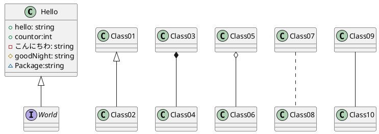

# PlantUML

- [Sample class](sample/sample_class.pu)
- [Sample sequence](sample/sample_sequence.pu)

## クラスの定義方法



```pu
' クラス定義
class Hello {
    ' +publicField
    +hello: string 
    +countor:int
    ' -privateField
    -こんにちわ: string 
    ' #Protected
    #goodNight: string
    ' ~Package
    ~Package:string
}

'インターフェース定義
interface World {}

'継承(◁-)
Hello <|-- World
Class01 <|-- Class02

'コンポジット(◆-)
'集約の一種になります。コンポジットは「全体」インスタンスが
'「部分」インスタンスの生成や削除を担っている場合
'全体インスタンスが削除されると、基本的には、
'連鎖して部分インスタンスも削除される関係になります。
Class03 *-- Class04

'集約(◇-) 
'関連のあるクラス同士が、「全体」と「部分」の関係にあるとき
' [部署]◇-[社員]　みたいな、、
Class05 o-- Class06

'依存(破線) クラス間で関係性はあるが、あまり強くない関係性の場合
Class07 .. Class08
'関連(線) クラスが複数あり、それらに何かしらの関係があるとき
Class09 -- Class10
```
