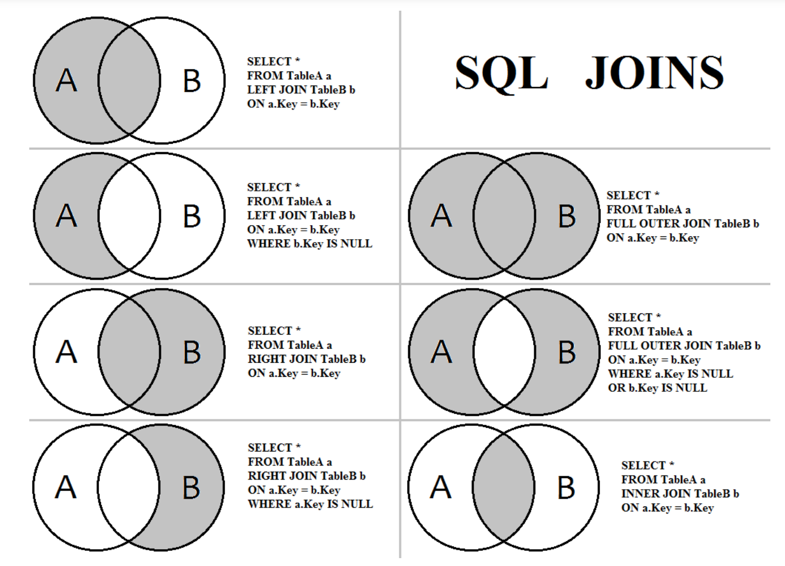

# SQL関連まとめ

好きじゃないがめんどくさいのでここにいろいろまとめる

- [oracle](oracle)
- [sqlite3](sqlite3)

```sql
-- sqlite3 だけ？っぽい
PRAGMA table_info('テーブル名')
```

---

## SQL クエリ関連について

- [Insert/Update/delete構文](#basic)
- [Joinについて](#join)
- [Unionについて](#union)
- [Mergeについて](#merge)

---

## <a name=basic>Select/Insert/Update/delete構文</a>

- select

```sql
言わずもがななので、省略
```

- insert構文

```sql
INSERT INTO テーブル名 (列名1, 列名2,...) VALUES (値1, 値2,...);

-- 🚨非推奨(並び変わったり、列名が変更された際に悲惨なことに)
INSERT INTO テーブル名 VALUES (値1, 値2,...);
```

- update構文

```sql
UPDATE (表名) SET (カラム名1) = (値1), (カラム名2) = (値2) WHERE (条件);

UPDATE employees SET title = 'Ms.'
WHERE emp_no IN (10006, 10007, 10009)
```

- Delete構文

```sql
Delete from テーブル名 where 条件 
```

---
---

## <a name=join>Joinについて</a>

left joinの場合`select * from [左テーブル] LEFT JOIN [右テーブル] ON ...`  
といった形でSQL文を作成できる



---
---

## <a name=union>Union/Union Allについて</a>

```sql
-- union(重複したレコードは削除される)
select test_pk, test_val from test1
union 
select test_pk, test_val from test2

-- union all(重複の削除は行わない)
select test_pk, test_val from test1
union all 
select test_pk, test_val from test2
```

---

## <a name=merge>Merge(upsert)文について</a>

近年追加された構文で1ステートメントでinsert/update/deleteを同時に実行できるSQL
ユースケースとして`upsert`,`複数のテーブルデータをマージ`するといった場合が考えられる

`insert on conflict`との違いとしては、`insert on conflict`は`insert`を主目的として競合時の処理を実行できるのに対し、
いるのに対しupdate/delete処理を選ぶことができる点がある。

```sql
/* 🌟例1----------------------------- */
MERGE INTO /* 操作対象テーブル */user1 a
USING ( /* 参照テーブル(🌟セレクトじゃなくてテーブル指定でもOK) */
    SELECT id, name, age
    FROM user2
    ) b
ON (a.id = b.id) /*　🌟結合条件 */
WHEN MATCHED THEN /* 🌟マッチする場合 */
    UPDATE SET
        a.name = b.name,
        a.age  = b.age
WHEN NOT MATCHED THEN /* 🌟マッチしない場合 */
    INSERT (id, name, age)
    VALUES (b.id, b.name, b.age)

/* 🌟例2----------------------------- */
MERGE INTO /*🌟更新先テーブル*/ user1 a
USING (
    SELECT id, name, age
    FROM user2
) b /* 利用元テーブル */
ON (a.id = b.id)
/* 🌟マッチする場合 */
WHEN MATCHED THEN 
    UPDATE SET
        a.name = b.name,
        a.age  = b.age
-- 🌟マッチしない場合
-- BY TARGETをつけることで更新先テーブルに条件と一致するデータが存在しない場合
WHEN NOT MATCHED BY TARGET THEN
    INSERT (id, name, age)
    VALUES (b.id, b.name, b.age)
-- 🌟マッチしない場合
-- 🌟BY SOURCE をつけることで利用元テーブルに条件と一致するデータが存在しない場合
WHEN NOT MATCHED BY SOURCE THEN
    DELETE;
```
