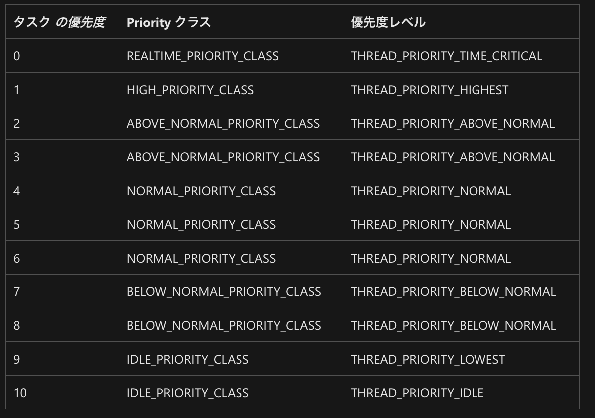
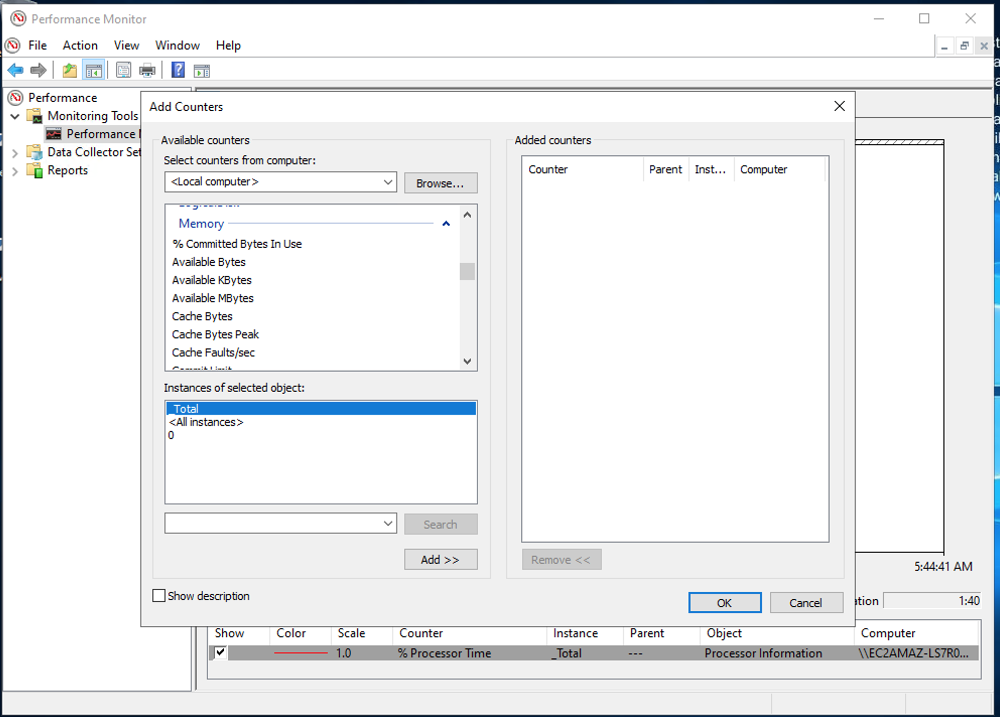

# Windowsについて

不服だが、仕事上使うのでメモを書いていく

- [cmd,PowerShellの違い](#shell)
  - [CMDについて](cmd)
  - [PowerShellについて](PowerShell)
  - [PSによるIP設定まわり](PowerShell/ip_setting)

- [マクロ](VBA)  
- [Debugについて](Debug)
  - [Edge-IEモードでのデバッグ](#edgeIE)
  - [CMDから起動中のタスクをチェックする](#tasklist)

- [CLコマンド](cl)

- [パフォーマンスについて](performance)
- [イベントログ](#EventLog)  
- [ネットワーク(netsh)](#network)  
- [SQLServerについて](SQLServer)
- [リソース集計バッチ](#resource)
- ファイルを開いているプロセス特定方法について
  - [handle.exe](https://jpwinsup.github.io/blog/2023/05/25/Storage/Management/handle/)

👇いいこと書いてるので、おすすめ時間ある時に読む  
[日本マイクロソフト TechnologySupportBlog](https://jpwinsup.github.io/blog/)
[gitアカウント](https://github.com/jpwinsup)

---
---

## <a name=edgeIE>Edge-IEモードのデバッグ</a>

EdgeのIEモードは開発者ツールが使えない('F12'で開くやつ)
`IEChooser.exe`を使えばIEモードのEdgeでも開発者ツールが利用できる。

```bat
C:\Windows\System32\F12\IEChooser.exe
```

---
---

## <a name=tasklist>CMDから起動中のタスクをチェックする</a>

```cmd
tasklist

# 名前でソートする場合(/nh:ヘッダなしにしないとヘッダもソートされる)
tasklist /nh | sort

# csv形式出力(/fo csv)
tasklist  /svc /fo csv  > test.csv

# /V (verbose)
tasklist  /fi "CPUTIME gt 00:00:10" /V /fo csv

```

---
---

## <a name=taskschd>タスクスケジューラの設定</a>

タスクスケジューラはデフォルトで実行優先度が通常より低めに設定される。
以下のリンクから設定の変更方法を確認することができる。


[TaskSettings.Priority プロパティ](https://learn.microsoft.com/ja-jp/windows/win32/taskschd/tasksettings-priority)

---
---

## <a name=shell>cmd,PowerShellの違い</a>

`cmd`と`PowerShell`の違いについてまとめる。
`cmd`は古くからあるが、`PowerShell(以下PSで省略)`はWindows7から追加された機能で`cmdより強力`で`スクリプトを描くための言語`である。  
`cmdで使えるコマンド`は，ほぼすべて`PowerShellでも利用可能`です。  
また、`cmd`では，`レジストリやWMI`にアクセスすることは難しいですが，  
`PowerShellでは標準的にサポート`されており，システムの管理業務に役に立ちます。  

実際には，`PS`は`CMD`とは全くことなります。  
`コマンドレット(cmdlets)`と呼ばれる独自のコマンドを用います。

### コマンドプロンプトで使えるほとんどのコマンドが，PowerShellでも利用可能です

PowerShellの内部でエイリアスが設定されており，例えばSet-Locationというコマンドレットにはcdという従来のコマンドが対応するようになっています。また，Get-ChildItemはコマンドプロンプトでいうdirに相当する，という具合です。

- 対応の確認には`Get-Aliasコマンド`が使える。

```powershell
Get-Alias dir
```

---
---

## <a name=EventLog>イベントログについて</a>

`イベントログ`は`イベントログビューア`でも確認できるが、
いちいちアプリを起動するのは鬱陶しい。
バッチを叩いてログを収集したい。
そのためのメモをここに残す。

```powershell
# ログだけ取りたいならこれ。
Get-WinEvent

# イベントログビューアを起動 まあ、いらない  
# /? オプションをつけることでhelpを表示できる
eventvwr.exe
```

- サンプル1
    イベントログを取得
    (syslog,applicationログを別々に出力する場合)

```powershell
#任意の出力先フォルダと-afterで指定する時間を設定
$OutPutFolder = Join-Path ([Environment]::GetFolderPath('Desktop')) "EventLogs"
if(!(Test-Path $OutPutFolder)){ mkdir $OutPutFolder }
$yesterday = (Get-Date).Date.AddDays(-1)

#Systemログ、Applicationログを別々に$OutPutFolderへ保存する処理。
@("System", "Application") | %{
    Get-EventLog $_ -After $yesterday |
    ?{ ($_.EntryType -eq "Error") -or ($_.EntryType -eq "0") } |
    Export-Csv -Encoding Default -NoTypeInformation -Path (
        Join-Path $OutPutFolder ($_ + "Log_" + (Get-Date).Date.ToString("yyyyMMdd") + ".csv") #任意の出力ファイル名
    )
}
```

- サンプル2
    イベントログを取得
    (syslog,applicationログを別々に出力する場合)

```powershell
#任意の出力先フォルダと-afterで指定する時間を設定
$OutPutFolder = Join-Path ([Environment]::GetFolderPath('Desktop')) "EventLogs"
if(!(Test-Path $OutPutFolder)){ mkdir $OutPutFolder }
$yesterday = (Get-Date).Date.AddDays(-1)

Get-WinEvent -FilterHashtable @{
    LogName='System', 'Application'
    Level=1,2
    StartTime=$yesterday
} | 
Select-Object -Property * |
Export-Csv -Encoding Default -NoTypeInformation -Path (
        Join-Path $OutPutFolder ("WinEventLog_" + (Get-Date).Date.ToString("yyyyMMdd") + ".csv") #任意の出力ファイル名
    )

```

[Get-WinEvent使い方](https://forsenergy.com/ja-jp/windowspowershellhelp/html/62e7642c-51d4-47d1-97fe-62b08197896a.htm)
[🌟イベントログ -> CSVファイル出力](https://qiita.com/hara_power/items/073fa6079e633f084412)

---

## <a name=network>ネットワーク設定バッチ</a>

- 外部向けIP設定

```powershell
# 🌟 ファイアウォール有効
netsh advfirewall set allprofiles state on

# 🌟固定IPアドレス/デフォルトゲートウェイ有り
netsh interface ip set address "ローカル エリア接続" static 192.168.xxx.xxx 255.255.255.0 192.168.yyy.yyy
# 🌟2番目のIPアドレスを設定する場合
netsh interface ip add address name="ローカル エリア接続" addr=10.0.0.1 255.255.255.224
# 🌟追加したIPを削除する
netsh interface ip delete address name="ローカル エリア接続" addr=10.0.0.1 mask=255.255.255.224

# 🌟DNS 指定有り
netsh interface ip set dns "ローカル エリア接続" static 192.168.aaa.aaa primary validate=no
netsh interface ip set dns "ローカル エリア接続" static 192.168.bbb.bbb validate=no

# 🌟NIC名称変更
netsh interface set interface name="旧名称" newname="新名称"

# 🌟DHCPにする場合
netsh interface ip set address "ローカル エリア接続" dhcp

# 🌟VLANIDの設定方法
netsh bridge set vlanid "接続名" "VLAN ID"
```

- 内部向けIP設定

```powershell
# 固定IPアドレス/デフォルトゲートウェイ無し
netsh interface ip set address "ローカル エリア接続" static 192.168.xxx.xxx 255.255.255.0 none
# 🌟DNS 無効
netsh interface ip set dns "ローカル エリア接続" none
# ファイアウォール無効
netsh advfirewall set allprofiles state off
```

- 設定内容確認

```powershell
# 🌟NIC名確認方法
netsh interface show interface
# 🌟IP確認方法
netsh interface ip show address "ローカル エリア接続"
netsh interface ip show dns "ローカル エリア接続"
```

- ネットワーク確認プロンプト

```powershell
# 接続ポートを確認
netstat -aon
netstat /a  # すべて表示、待ち受けのポートも表示

# MACアドレスキャッシュ一覧
arp -a

# ホスト名 ⇆ IPアドレス
nslookup {hostname}
nbtstat -A {IP address}
```

---
---

## <a name=resource>リソース使用料集計バッチ</a>

```batch
# CPU/メモリ使用可能料出力
# %%はバッチ用エスケープなので、%で読み替えて、
# -si <sec> サンプリング間隔(sec)
# -sc <num> 収集するサンプル数 
typeperf -y -si 1 -o resource.csv "\Process(*)\%% Processor Time" "\Memory\Available Bytes"

# helpコマンド
typeperf -?

# typeperfで確認できるメトリックは以下で確認できる
typeperf -q
typeperf -qx

# -cf <ファイル名> 
# 一行ごとにカウンターを記載することで収集する対象を書ける
typeperf -cf counters.txt -si 5 -sc 50 -f TSV -o domain2.tsv

# typeperfでなくともCPU/memory使用率をtasklistで確認することもできる(filter付きで)
tasklist /fi “MEMUSAGE gt 1000000” /fi “CPUTIME gt 00:01:00”
```

### CPU使用率調査有効メトリック

- [参考](https://jpwinsup.github.io/blog/2022/07/15/Performance/SystemResource/PerformanceCounterProcessor/)

```batch
# 🌟システム全体での CPU 使用率
\Processor Information\ % Processor Utility

# CPU が idle 以外のスレッドを実行するために使用した経過時間の割合
\Processor Information\ % Processor Time

# CPU の処理を待つスレッドの数
\System\Processor Queue Length

## 🌟🌟🌟🌟🌟プロセスごとの CPU 使用状況🌟🌟🌟🌟🌟
# プロセスのスレッドすべてが、命令を実行するためにプロセッサを使用する経過時間の割合
# Processor = Privileged + User となる。
\Process(プロセス名)\ % Processor Time

# プロセスのスレッドが特権モードでコードを実行するために費やす時間の割合
\Process(プロセス名)\ % Privileged Time
# プロセスのスレッドがユーザー モードでコードを実行するために費やす時間の割合
\Process(プロセス名)\ % User Time

```

### メモリ使用率調査有効メトリック

- [Microsoft 参考](https://jpwinsup.github.io/blog/2021/10/26/Performance/SystemResource/PerformanceCounterMemory/)

```batch
# 利用可能な物理メモリの大きさ(※使用量ではない)
\Memory\Available Bytes
\Memory\Available KBytes
\Memory\Available MBytes

## 🌟🌟🌟🌟🌟プロセスごとの メモリ 使用状況🌟🌟🌟🌟🌟
# 各プロセスが割り当てた物理メモリ使用量
\Process(プロセス名)\Working Set

# 各プロセスが割り当てた他のプロセスと共有できない物理メモリ使用量
\Process(プロセス名)\Working Set - Private

# 各プロセスが割り当てた他のプロセスと共有できない仮想メモリの使用量 
\Process(プロセス名)\Private Bytess
```

以下のパフォーマンスモニタを参考に集計メトリックが確認できる。


