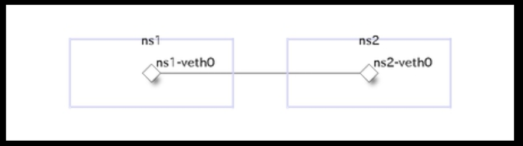

# Linux/network namespace

`network namespace`を使って仮想ネットワークを作成する

## network namespace を作成/削除する

```bash
#sudo ip netns add namespace名
sudo ip netns add helloworld

#sudo ip netns delete namespace名
sudo ip netns delete helloworld

# これで作成/削除したnamespaceが見れる
ip netns show 
```

---
---

## network namespaceでコマンドを実行する

```bash
# ip netns exec "namespace"  "command"
ip netns exec helloworld bash
ip netns exec helloworld ip addr show
```

---
---

## 作成したnamespace間を繋げる

namespace間は独立したネットワークなので、通信するには仮想的なLanをnamespaceに繋ぐ必要がある。
画像のように作成したネットワークに属した仮想ethを作成し、ネットワーク間で繋げるイメージ



```bash
sudo ip netns add ns1
sudo ip netns add ns2
```

- 仮想NICを作成する

```bash
# veth(仮想NICを作成する)
# ns1-veth0 / ns2-veth0 の仮想NICが作成される。(1対1で繋がってるイメージ？)
sudo ip link add ns1-veth0 type veth peer name ns2-veth0

# vethを確認(作成したnic間で繋がっていることを確認できる)
ip link show 
ip link show | grep veth
```

- 仮想NICをネームスペースに接続する

```bash
# 仮想NICをネームスペースに繋げる
sudo ip link set ns1-veth0 netns ns1
sudo ip link set ns2-veth0 netns ns2
```
