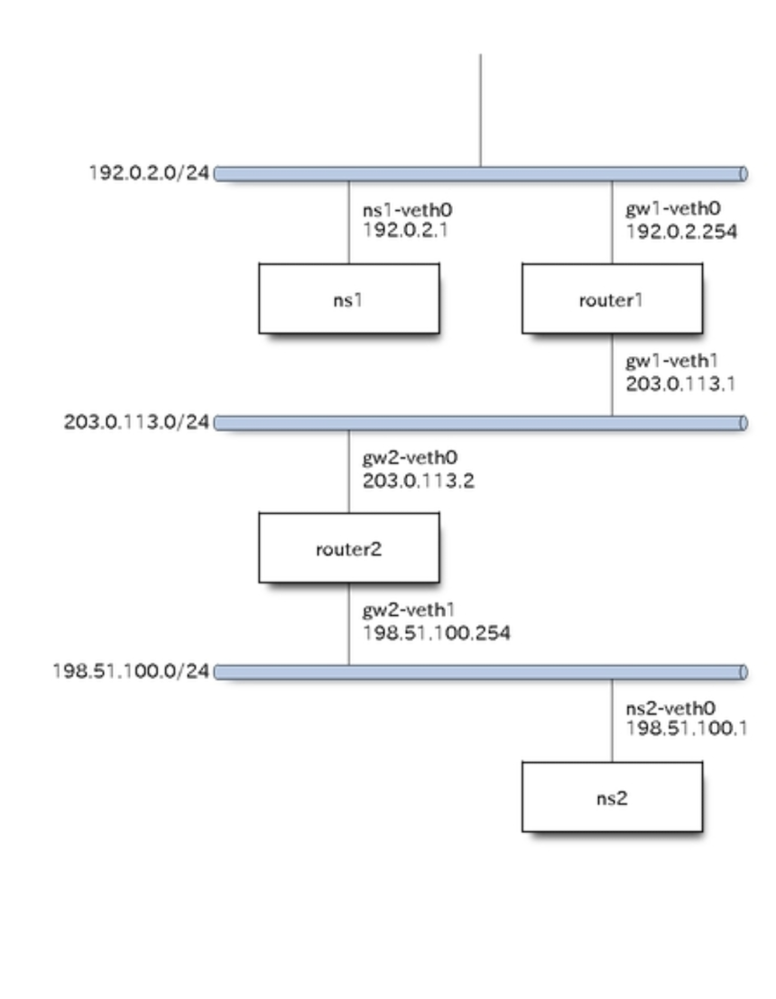

# Linux/network namespace

`network namespace`を使って仮想ネットワークを作成する

## network namespace を作成/削除する

```bash
#sudo ip netns add namespace名
sudo ip netns add helloworld

#sudo ip netns delete namespace名
sudo ip netns delete helloworld

# これで作成/削除したnamespaceが見れる
ip netns show 
```

---
---

## network namespaceでコマンドを実行する

```bash
# ip netns exec "namespace"  "command"
ip netns exec helloworld bash
ip netns exec helloworld ip addr show
```

---
---

## 作成したnamespace間を繋げる

namespace間は独立したネットワークなので、通信するには仮想的なLanをnamespaceに繋ぐ必要がある。
画像のように作成したネットワークに属した仮想ethを作成し、ネットワーク間で繋げるイメージ


```bash
ip netns add ns1
ip netns add ns2
```

- 仮想NICを作成する

  - `ip link`
    - `ネットワークインタフェース`の作成/リンク状態の確認や、LinkUp/Downの設定に使う
    仮想Lan/TagVLan等を作成できる

```bash
# veth(仮想NICを作成する)
# ns1-veth0 / ns2-veth0 の仮想NICが作成される。(1対1で繋がってるイメージ？)
ip link add ns1-veth0 type veth peer name ns2-veth0

# vethを確認(作成したnic間で繋がっていることを確認できる)
ip link show 
ip link show | grep veth
```

- 仮想NICをネームスペースに接続する

```bash
# 仮想NICをネームスペースに繋げる
ip link set ns1-veth0 netns ns1
ip link set ns2-veth0 netns ns2

# 仮想NICにIPを割り当てる(*まだstateがdownとなっているので通信はできない)
ip netns exec ns1 ip address add 192.0.2.1/24 dev ns1-veth0
ip netns exec ns2 ip address add 192.0.2.2/24 dev ns2-veth0

# 以下で確認できる
ip netns exec ns1 ip link show ns1-veth0 | grep state
ip netns exec ns2 ip link show ns2-veth0 | grep state

ip netns exec ns1 ip link set ns1-veth0 up
ip netns exec ns2 ip link set ns2-veth0 up
```

---
---

## 作成したnamespace間を繋げる2

- gatewayを複数挟んだ通信の模擬環境を作成する(以下イメージで通信を行う)



- namespaceを作成する

```bash
# namespaceを全てクリアする
# ip --all netns delete

# namespaceを作成する
ip netns add ns1
ip netns add router1
ip netns add router2
ip netns add ns2
```

- 仮想NICを作成する

```bash
# Veth作成
ip link add ns1-veth0 type veth peer name gw1-veth0
ip link add gw1-veth1 type veth peer name gw2-veth0
ip link add gw2-veth1 type veth peer name ns2-veth0

# namespaceに接続
ip link set ns1-veth0 netns ns1
ip link set gw1-veth0 netns router1
ip link set gw1-veth1 netns router1
ip link set gw2-veth0 netns router2
ip link set gw2-veth1 netns router2
ip link set ns2-veth0 netns ns2

# Link Up
ip netns exec ns1 ip link set ns1-veth0 up
ip netns exec router1 ip link set gw1-veth0 up
ip netns exec router1 ip link set gw1-veth1 up
ip netns exec router2 ip link set gw2-veth0 up
ip netns exec router2 ip link set gw2-veth1 up
ip netns exec ns2 ip link set ns2-veth0 up
```

- 仮想NICにIPを割り当てる

```bash

ip netns exec ns1 ip address add 192.0.2.1/24 dev ns1-veth0
ip netns exec router1 ip address add 192.0.2.254/24 dev gw1-veth0

ip netns exec router1 ip address add 203.0.113.1/24 dev gw1-veth1
ip netns exec router2 ip address add 203.0.113.2/24 dev gw2-veth0

ip netns exec router2 ip address add 198.51.100.254/24 dev gw2-veth1
ip netns exec ns2 ip address add 198.51.100.1/24 dev ns2-veth0
```

- ルーティング設定をする

1. スタティックルーティング 人間が手でルーティングエントリを追加するような方式
2. ダイナミックルーティング ルータ同士が自律的に自身の知っているルーティング情報を教えあう方式

```bash
# ns1/ns2のNICにゲートウェイ設定を割り当てる
# *それぞれ直結したルータ宛となっていることに注意
# gateway設定しないと、、出力先のNICがわからないのでPingも出て行かない
ip netns exec ns1 ip route add default via 192.0.2.254
ip netns exec ns2 ip route add default via 198.51.100.254

# ルータ側のカーネルパラメータを以下のコマンドで変更する
ip netns exec router1 sysctl net.ipv4.ip_forward=1
ip netns exec router2 sysctl net.ipv4.ip_forward=1

# 各ルータのネームスペースに対してルーティング設定をする
# ip route add "宛先のサブネット等" via "ルーティング先IP(ルーティング先IP)"
# router1/2それぞれ、ルーティング先にrouter2/1を指定していることに注意
ip netns exec router1 ip route add 198.51.100.0/24 via 203.0.113.2
ip netns exec router2 ip route add 192.0.2.0/24 via 203.0.113.1

# 一応、以下のようにdefault gateway設定をすることで
# route1に来たパケットをroute2へ、
# route2に来たパケットをroute1へといったルーティングできるようになる
# ip netns exec router1 ip route add default via 203.0.113.2
# ip netns exec router2 ip route add default via 203.0.113.1

```
